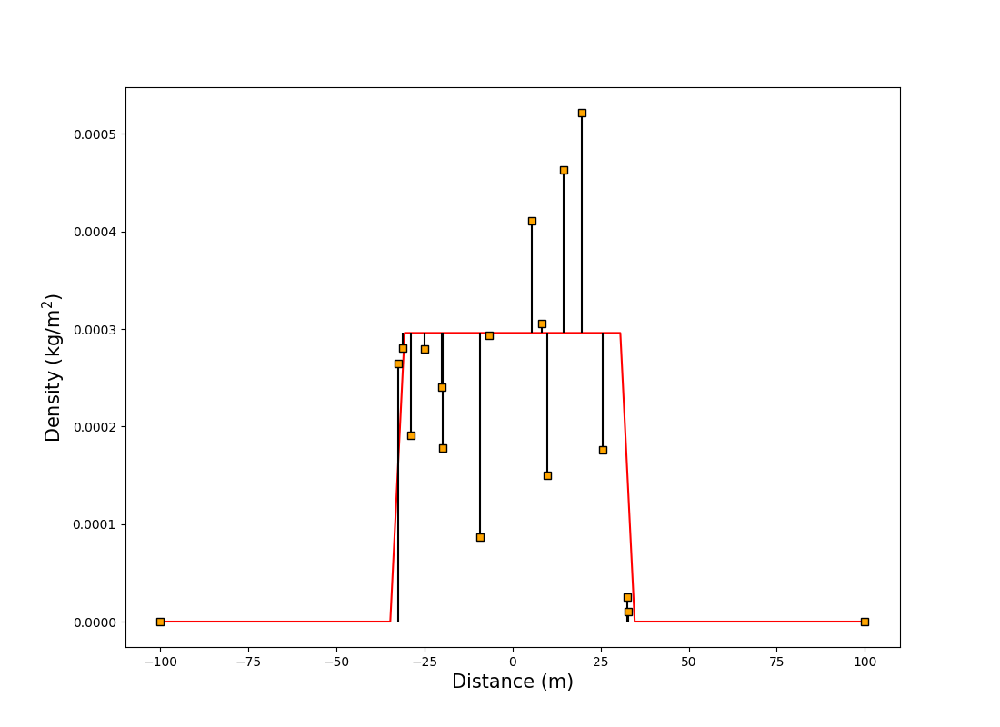
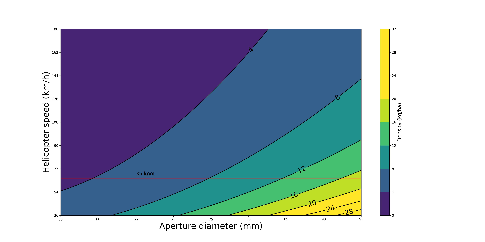
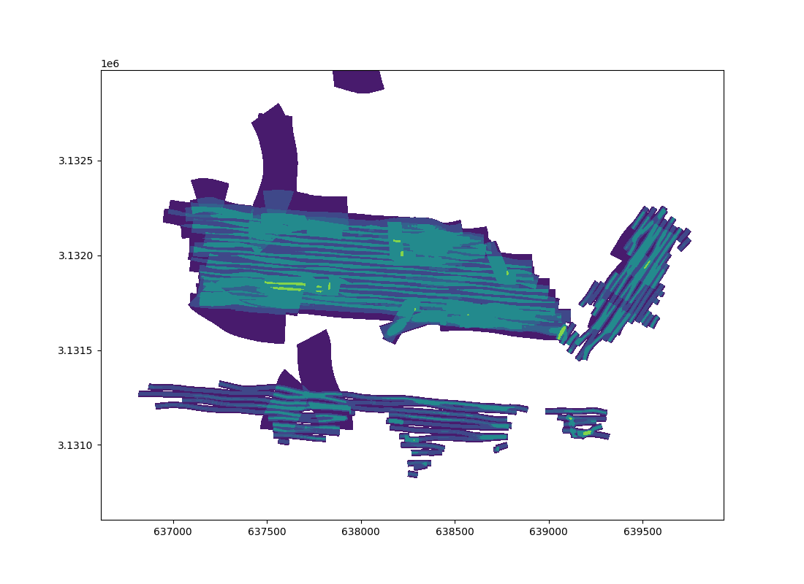

---
title: 'NERD: Numerical Estimation of Rodenticide Density'
tags:
  - aerial broadcast
  - bait bucket
  - Python
  - rodent eradication
  - rodenticide bait density
authors:
  - name: Evaristo Rojas-Mayoral
    orcid: 0000-0001-6812-9562
    corresponding: true
    affiliation: 1
  - name: Braulio Rojas-Mayoral
    orcid: 0000-0003-2358-2843
    affiliation: 1
  - name: Federico A. Méndez-Sánchez
    orcid: 0000-0002-3467-0008
    affiliation: 1
affiliations:
  - name: Grupo de Ecología y Conservación de Islas
    index: 1
bibliography: references.bib

...

# Summary

Invasive rodents are present on approximately 90% of islands worldwide, seriously threatening endemic and native island species and making rodent eradication central to island conservation. Aerial broadcast is the preferred dispersal method of rodenticide bait. 
Therefore, accurate bait density maps must be generated in real-time to maximize the efficiency of rodent eradication campaigns utilizing aerial dispersal methods. 
Traditionally, conservationists rely on ground-level bait dispersion maps generated using Geographic Information Systems (GIS). 
However, this approach is time-consuming and based on untested assumptions. 
To improve the accuracy and efficiency of aerial operations, we developed NERD (Numerical Estimation of Rodenticide Density), an algorithm that performs highly precise calculations and provides immediate results. 
At its core, NERD  is a probability density function describing bait density on the ground as a function of the aperture diameter of the rodenticide bucket and helicopter speed. 
We have confirmed the effectiveness of the model by successfully utilizing it in two island rodent eradication campaigns: mice eradication on San Benito Oeste (400 ha) in the Mexican Pacific and ship rat eradication on Cayo Centro (539 ha) of Banco Chinchorro in the Mexican Caribbean. 
Notably, the Cayo Centro campaign is the largest rodent eradication ever conducted on a wet tropical island to date. We have proved the efficiency of NERD and its potential to reduce the overall cost of large-scale rodent eradication campaigns significantly.

# Introduction

Invasive rodent species are incredibly deleterious to island ecosystems, especially those with levels of endemism or those without higher-order predators or predators occupying similar niches to the invasive rodents [@Meyers2000]. 
Invasive rodent population dynamics are poorly understood on islands [@Harper2015]. 
However, rodents on islands can cause native plant and animal species to decline rapidly and severely, even to extinction [@Medina2011; @Towns2006]. 
The resultant losses are reflected in reduced biodiversity and, in many cases, invasive rodents becoming the dominant species. 
In cases of severe rodent invasion, critical island ecosystem services are lost [@Towns2006]. 
The first step to restoring islands and recovering biodiversity is eradicating invasive rodents.
Effective strategies to combat the detrimental effects of invasive rodent species on island ecosystems aim to minimize or eradicate rodent populations, facilitating the restoration of native species and crucial ecosystem processes. 
The aerial broadcast of rodenticide is widely utilized and involves dispersing rodenticide bait pellets from helicopters over target areas. 
Aerial broadcast effectively reduces rodent populations and has been successfully employed in numerous eradication campaigns [@Keitt2015].

# Statement of need

Aerial rodenticide broadcast is the preferred method to eradicate invasive island species because of its obvious advantages. Aerial broadcast can quickly cover large areas with bait, mitigating the challenges associated with navigating complex topography by land. 
Bait density maps that show the spatial variation in availability on the ground are necessary to assess the effectiveness of aerial operations. 
However, creating bait density maps is traditionally slow and impractical in the field. 
Moreover, taking in situ measurements to evaluate aerial rodenticide broadcasts can be challenging due to field conditions, topography, and labor required.

We developed NERD (Numerical Estimation of Rodenticide Dispersal) to address these challenges. NERD generates bait density maps automatically, allowing for the instant identification of bait gaps with fewer in situ measurements and facilitating the evaluation of helicopter rodenticide dispersal campaigns. 
NERD requires prior calibration experiments to determine the mass flow of rodenticide through the bait bucket. 
At its core, NERD is a probability density function that describes bait density on the ground as a function of the bucket aperture diameter and helicopter speed.

# Formulation

@Rojas2019 showed that the function $\sigma(x,y)$ to represent superficial bait density (kg/m$^2$) must comply with the following property:
\begin{equation}
\int_{-\frac{w}{2}}^{+\frac{w}{2}} \sigma(x)dx=\frac{\dot{m}}{s},
  \label{eq:DensityIntegralIsFluxOverSpeed}
\end{equation}
where $\dot{m}$ is the bait flow (kg/s), $s$ is the speed of the helicopter (m/s), and $w$ is the swath width (m).

# Calibration

Assuming the density is independent of $x$ (i.e., $\sigma$ does not change along the swath width) and expressing the mass flow rate of the bait as a function of the aperture diameter, $\dot{m}(d)$, we obtain a two-parameter model:

\begin{equation} \sigma(d,s)= \frac{\dot{m}(d)}{s\cdot w}. \end{equation}

We obtained the mass flow rate as a function of the aperture diameter of the bait bucket by measuring the time required to empty the bucket. 
We repeated this using several aperture diameters and a known initial mass.

## Fit flow rate

![Flow rate $\dot{m}$ (kg/s) as a function of the aperture diameter [$d$ (mm)]. Each dot represents a calibration event. The blue curve is the quadratic model fitted to the data.\label{fig:calibration}](figures/calibration.png)

## Swath width

## Select best density function

Figure \ref{fig:density_profile} shows the relationship between the bait density and parameters following calibration.

We can assume a variable bait density across each swath to account for the higher density of rodenticide below the helicopter compared to the lower density along the edges of the swath. 
In doing so, we can detect areas with bait density below the lower limit of the target bait density and bait gaps on the ground.

## Density as function of speed and aperture diameter size

From the calibration, we obtain Figure \ref{fig:contour_plot}.

## Demonstration using a configuration file

There is another way to setup the model parameters using a json file.

# Use cases

Each island requires a specific bait density to eradicate invasive rodents successfully, which requires studying the ecosystem and biology of the target species.

NERD is extremely useful when planning an eradication campaign because it can ensure efficient bait coverage while maximizing resources, time, and labor requirements.
For example, we can use NERD to determine the bait bucket diameter necessary to achieve the desired bait density on the ground.
While planning helicopter flight paths, bait density is assumed to be constant within each swath but variable between swaths.

NERD is also incredibly useful during an eradication campaign. Notably, conservationists can use NERD to generate bait density maps in nearly real-time. 
Notably, we can evaluate bait density on the ground, even when the helicopter flies at variable speeds.
The NERD maps can identify bait gaps during eradication campaigns in the field, ensuring an efficient use of resources.

# Conclusions

NERD is an algorithm that describes bait density as a function of the aperture diameter and helicopter speed, based on past calibration experiments measuring rodenticide mass flow through a bait bucket.
NERD can aid in planning aerial operations and during eradication campaigns by providing near real-time feedback and allowing for on-the-spot corrections. 
The final product of NERD is a bait density map generated in a matter of seconds, allowing for the instant identification of bait gaps and ensuring efficient resource use.

# References
